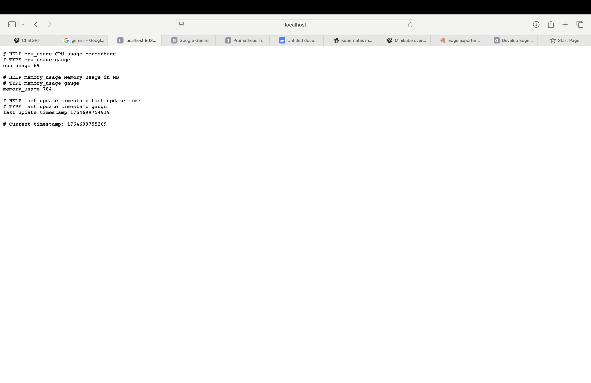
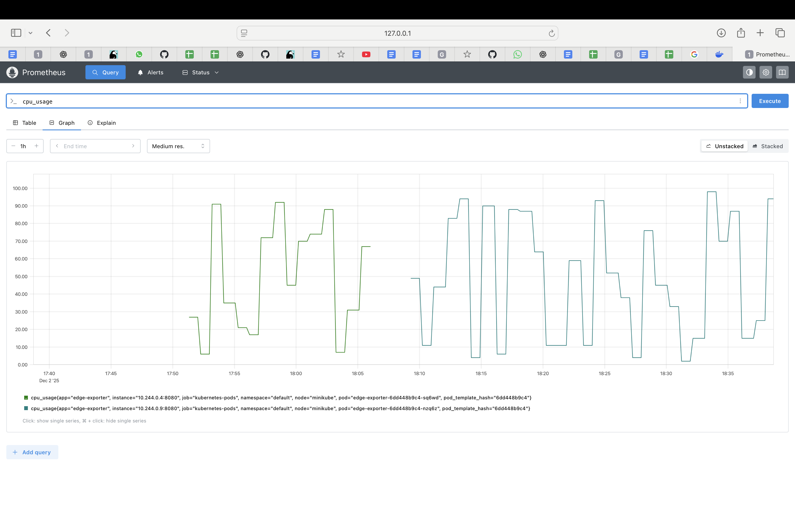
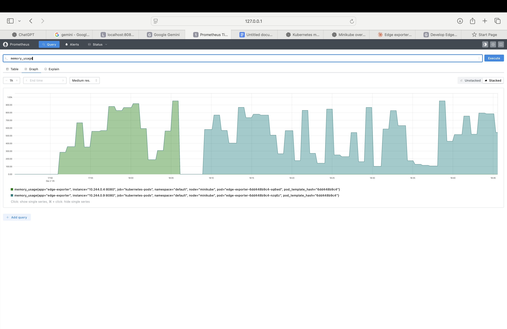

# Develop Edge Device Metrics Export Tool for Kubernetes (Simulated)

This guide provides the steps and commands necessary to set up a simulated edge device metrics export tool that integrates with a Kubernetes-native monitoring system (Prometheus ecosystem).

**Tech Stack:** Basics of YAML, Command-line, Simple Python/Go (Simulated)

---

## Core Components

The standard approach uses the Prometheus ecosystem, with the tool acting as a custom metrics exporter.

- **Edge Device Simulator (Python/Go):** A script that generates simulated metrics (e.g., `cpu_usage`, `memory_allocated`).
- **Kubernetes Manifests (YAML):** Configuration files to deploy the simulator and necessary services in Kubernetes.
- **Command-line Interface (CLI):** `kubectl` and possibly `curl` for deployment and verification.

> **Note:** Prometheus is a system that collects, stores, and queries time-series metrics.

### Key Design Constraints:

- ✅ Only 1 Python file (The metrics server: `exporter.py`)
- ✅ Only 1 Kubernetes YAML file (The deployment: `edge-exporter.yaml`)
- ✅ No Prometheus client library (Simple text output)
- ✅ No DaemonSet, only a single Pod (Simplest deployment)
- ✅ Works with `curl`, `kubectl`, and Docker

---

## 1. Prerequisites & Minikube Setup

Minikube starts a single-node Kubernetes cluster for local development.

### 1.1 Minikube Installation

```bash
brew install minikube
```

### 1.2 Start Minikube & Check Status

```bash
minikube start
kubectl get nodes
```

You should see the node status:

```
NAME          STATUS   ROLES           AGE   VERSION
minikube      Ready    control-plane   53s   v1.34.0
```

### 1.3 Configure Local Docker Environment (Crucial Step)

Make Minikube use your local Docker daemon so the image you build is accessible inside the cluster.

```bash
eval $(minikube docker-env)
```

---

## 2. Build & Deploy the Exporter

### 2.1 Build the Docker Image

Build the container image using the Dockerfile in the current directory.

```bash
docker build -t edge-metrics .
```

### 2.2 Create the Kubernetes YAML File

You must have the `edge-exporter.yaml` file ready. This manifest defines:
- A **Deployment** (to run the Pod)
- A **Service** (to expose the metrics port 8080 internally, annotated for Prometheus scraping)

### 2.3 Deploy to Kubernetes

Run the following command to deploy the resources defined in the YAML file:

```bash
kubectl apply -f edge-exporter.yaml
```

### 2.4 Check Pod Status

Check the status of the Pod deployed by your Deployment.

```bash
kubectl get pods
```

> **Simple Definition:** A Pod is the smallest deployable unit in Kubernetes. It's a box that usually contains one container (your Python metrics exporter).

You should see output similar to this:

```
NAME                                     READY   STATUS    RESTARTS   AGE
edge-exporter-deployment-xxxxx           1/1     Running   0          5s
```

### 2.5 Forward Port to Check Metrics (Verification)

Find the exact Pod name and forward its port 8080 to your local machine to ensure the metrics server is live and responding. Prometheus-style metrics must change every time you refresh.

**Find the Pod name:**

```bash
kubectl get pods
```

**Forward the port:** (Open a dedicated terminal window)

```bash
kubectl port-forward <pod-name> 8080:8080
```

**Test the output:** (Open a new terminal window)

```bash
curl http://localhost:8080/metrics
```

---

## 3. Connect to Prometheus (Monitoring)

### STEP 3.1 — Access Prometheus UI inside Minikube

Run this command to automatically open the Prometheus UI in your browser:

```bash
minikube service prometheus-server
```

> **Note:** Keep this terminal window open — it handles the connection/proxy.

### STEP 3.2 — Verify your exporter is being scraped

In the Prometheus UI, go to: **Status → Targets**.

Look for your `edge-exporter-service` pod in the table.

It should show **State = UP**.

If it shows **DOWN**, check the pod logs:

```bash
kubectl logs <pod-name>
```

### STEP 3.3 — Query your metrics in Prometheus

Go to the **Graph** tab in the Prometheus UI.

In the expression box, type the name of one of your custom metrics:

```
cpu_usage
```

Click **Execute**.

Switch to **Graph** view: you should see metrics updating.

Repeat with your other metric:

```
memory_allocated
```

---

## Project Structure

```
project/
├── exporter.py              # Python metrics exporter script
├── edge-exporter.yaml       # Kubernetes deployment manifest
├── Dockerfile               # Container image definition
└── README.md                # This file
```

---

## Troubleshooting

### Common Issues

**Issue:** Pod shows `ImagePullBackOff` error
- **Solution:** Ensure you ran `eval $(minikube docker-env)` before building the Docker image

**Issue:** Metrics endpoint returns connection refused
- **Solution:** Verify the pod is running with `kubectl get pods` and check logs with `kubectl logs <pod-name>`

**Issue:** Prometheus shows target as DOWN
- **Solution:** Check that the Service is properly configured and the pod is exposing metrics on port 8080

**Issue:** `minikube service prometheus-server` fails
- **Solution:** Ensure Prometheus is installed in your cluster. You may need to install it using Helm or kubectl apply

---

## Cleanup

To remove all deployed resources:

```bash
kubectl delete -f edge-exporter.yaml
```

To stop Minikube:

```bash
minikube stop
```

To delete the Minikube cluster:

```bash
minikube delete
```

---

## Next Steps

- Add more realistic metrics (temperature, network throughput, disk I/O)
- Implement custom labels for multi-device scenarios
- Create alerting rules in Prometheus
- Add Grafana dashboards for visualization
- Scale to multiple edge device simulators

---

## Additional Resources

- Doc Link : https://docs.google.com/document/d/1X-oaQYzDJqMBkOdPitBkrnm5JZRhxBEBKUNdarT7dxU/edit?tab=t.0
- [Prometheus Documentation](https://prometheus.io/docs/)
- [Kubernetes Documentation](https://kubernetes.io/docs/)
- [Minikube Documentation](https://minikube.sigs.k8s.io/docs/)
- [Writing Exporters for Prometheus](https://prometheus.io/docs/instrumenting/writing_exporters/)


---
## Images 

### metrics-endpoint


### prometheus-cpu-usage-graph


### prometheus-memory-graph

---
